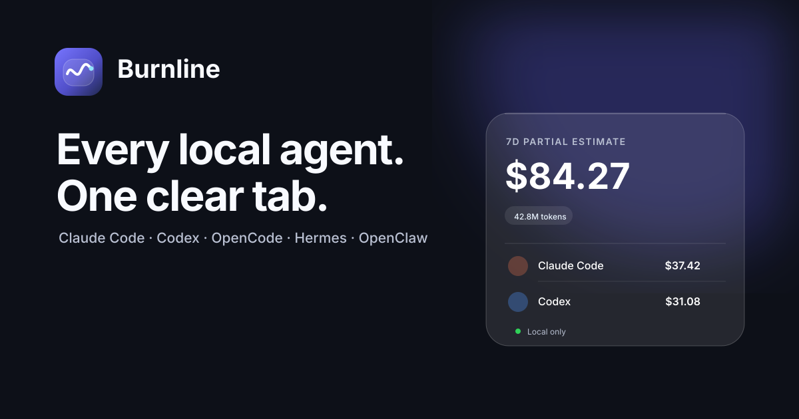

# Burnline

Burnline is a native macOS menu bar app that shows what your local coding agents cost.

It reads usage already stored on your Mac by Claude Code, Codex, OpenCode, Hermes, and OpenClaw. The menu gives you one total, an agent-by-agent breakdown, and today, 7-day, 30-day, or all-time views. No account, API key, browser cookie, or telemetry.



## What works

- Native SwiftUI menu bar app with an animated usage mark
- Apple Liquid Glass interface on macOS 26+, with a native material fallback on macOS 14–15
- Automatic discovery of five local agent stores
- Reported costs when the agent records them
- Local estimates for models in the bundled price book
- Token and cost totals by time range and agent
- Read-only collection with partial-result handling
- A local usage-only index so repeat scans do not reread unchanged transcripts

Costs are local records or estimates, not provider invoices. Burnline labels partial totals when a model has no matching price.

## Install

Download the universal DMG from the [latest GitHub release](https://github.com/prantikmedhi/burnline/releases/latest), open it, and drag Burnline into Applications.

The current community build is ad-hoc signed and not notarized. On first launch, macOS may ask you to confirm by right-clicking Burnline and choosing **Open**. Burnline requires macOS 14 or newer.

## Build from source

You need macOS 14 or newer and Xcode 16 or newer.

```sh
git clone https://github.com/prantikmedhi/burnline.git
cd burnline
swift test
./scripts/install.sh
```

The install script builds an ad-hoc signed developer copy at `~/Applications/Burnline.app` and opens it. It does not install a privileged helper or launch daemon.

For development:

```sh
swift run Burnline
```

## Local data sources

| Agent | Source |
| --- | --- |
| Claude Code | `~/.claude/projects/**/*.jsonl` |
| Codex | `~/.codex/sessions/**/*.jsonl` |
| OpenCode | `~/.local/share/opencode/opencode.db` |
| Hermes | `~/.hermes/state.db` |
| OpenClaw | `~/.openclaw/agents/*/sessions/*.jsonl` |

Environment overrides supported by the original tools are respected where practical. See [provider contracts](docs/PROVIDERS.md) for exact fields and known limits.

## Project map

- `Sources/Burnline` — menu bar UI and refresh loop
- `Sources/BurnlineCore` — collectors, normalized records, pricing, aggregation
- `Tests` — deterministic aggregation and pricing checks
- `assets/brand` — mark, lockup, and repository preview
- `docs` — product, architecture, provider, security, testing, and brand decisions

Start with [PRODUCT.md](docs/PRODUCT.md) and [ARCHITECTURE.md](docs/ARCHITECTURE.md).

## License

MIT. Burnline is independent software and is not affiliated with Anthropic, OpenAI, OpenCode, Nous Research, or OpenClaw.
